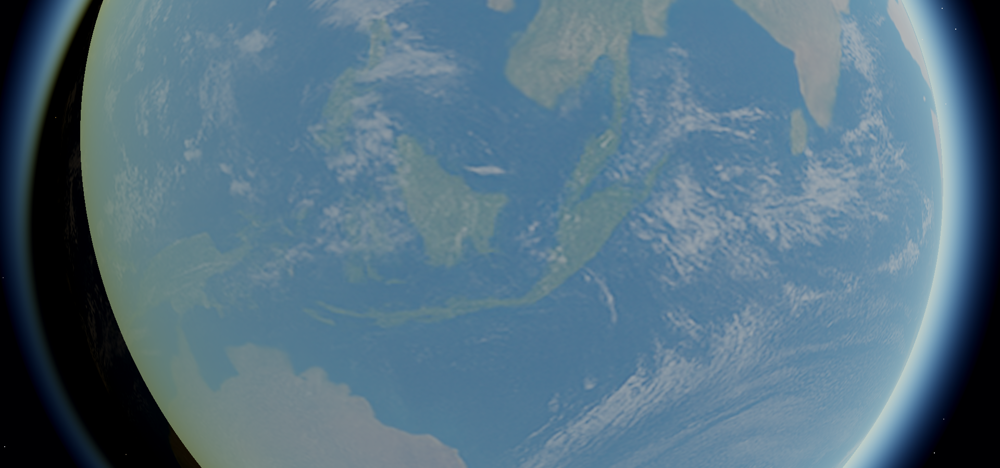
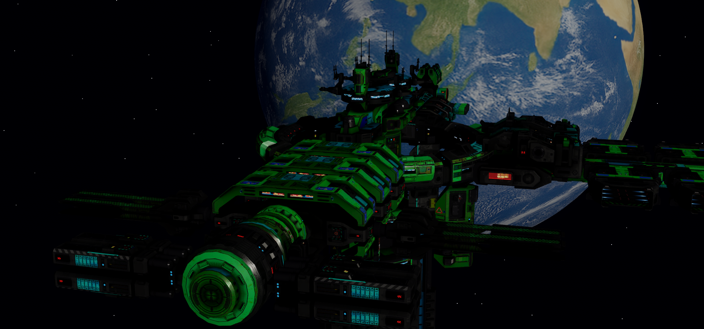
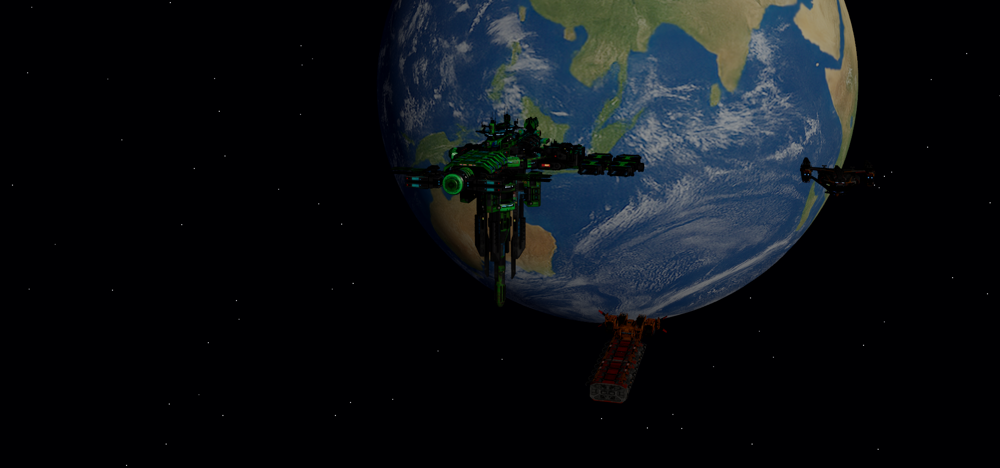

Pax3D
=====


**A modern, verified 3D engine for Python — with a first-party physically-based
rendering stack built in.**

Pax3D is a sovereign game engine for Python and C++ programs. It began in
February 2026 as a fork of Panda3D 1.11.0-dev and was deliberately made
standalone in July 2026: Pax3D evolves on its own terms, driven by the
shipping games built on it. It is free for any purpose, including commercial
use, under the Modified BSD License.

What makes it different:

- **A real renderer out of the box.** `pax3d_render/` is a first-party
  Python/GLSL physically-based pipeline — sun, shadows, HDR bloom,
  atmospheres, terrain, instancing, IBL — not an add-on you assemble.
- **Every rendering claim is measured.** The `tools/paxtest/` harness runs
  over a hundred offscreen render jobs with *analytic* checks (computed
  expected values, not eyeballed screenshots) on every change — and runs the
  same suite against stock Panda3D as a cross-reference. Features land with
  their proofs.
- **One modern reality.** Native GLSL 330 core profile, OpenGL core context
  everywhere, C++17. Roughly 43,000 lines of dead legacy surface (DirectX 9,
  GLES/WebGL, mobile targets) have been removed rather than maintained.
- **Battle-tested by shipping games.** Pax3D is developed against a space
  simulation and a voxel game in daily use; engine features arrive because a
  real game needed them, and stability fixes come from real field crashes,
  reproduced and gated.

Gallery
=======

Every shot below is an automated offscreen render from the testbed
(`--selftest`) — the same scene developers use to eyeball features as they
land, with assets from the games.

**Orbital atmospheric scattering** (`set_orbital_atmosphere`) — limb, halo
and terminator rendered from space, verified against an independent
integrator to ≤0.003:



**Station and fleet over Earth** — PBR pipeline, directional sun with
shadow mapping, HDR bloom, emissive materials:



**The testbed scene** — sun, planet, station, ships; boots in seconds with
hotkeys for every pipeline feature:



Feature Highlights
==================

Rendering (`pax3d_render/`)
---------------------------

- Physically-based pipeline with a linear color contract (sRGB-aware inputs),
  ACES / Hejl-Dawson / other tonemap operators, all verified against their
  analytic curves
- True directional sun with shadow mapping — texel snapping, world-space
  normal bias, per-node casting control
- HDR bloom on float intermediates, lens flare and dirt, SSAO
- Opt-in logarithmic depth for planetary-scale scenes
- Atmospheres both ways: aerial haze on the ground, and orbital
  limb/halo/terminator scattering seen from space (verified against an
  independent integrator)
- Image-based lighting: hemisphere / spherical-harmonic ambient, specular IBL
  with a correctly prefiltered GGX mip ladder, per-node environment bindings,
  env intensity / rotation controls
- Terrain: splat-driven 4-layer texture arrays with macro variation,
  stochastic hex-tiling (kills texture repetition), height-aware blending,
  and a wet-sand waterline system
- GPU instancing with correct instanced shadows; cutout alpha that fixes
  glTF `MASK` content silently rendering opaque on core profiles
- Characters: hardware skinning with per-node opt-outs, GPU morph targets at
  crowd scale (dozens of independent faces, zero-copy bakes), per-geom
  normal / occlusion detail maps
- Ships & interiors: rigid-clip extraction from glTF (doors, ramps, gear),
  powered display screens with flipbook / UV-scroll animation, nav-light
  circuits with synced real lights and halos, a per-root light-budget warden
- Baked effects: premultiplied flipbook explosions with one-shot lifecycle
- Photo mode: `render_snapshot()` — full-pipeline renders from any pose into
  a texture without disturbing the player's view
- Stall-free visibility queries (depth-tap, no mid-frame readback)

Engine core
-----------

- C++17 throughout; Python 3.13 wheels
- Windows x64 + OpenGL core is the primary target; X11/GLX and a software
  renderer (tinydisplay) are retained for headless and Linux futures
- Stability beyond the inherited baseline, each fix reproduced and
  permanently gated: cross-thread geometry churn heap corruption, foreign
  thread binding lifetime, offscreen framebuffer GL errors (the suite now
  enforces zero GL errors)
- Optional double-precision build (`STDFLOAT_DOUBLE`) — validated at
  solar-system coordinate scales
- Loud diagnostics where the fixed-function past used to fail silently

Where it's going
----------------

The roadmap is driven by the games: VR (OpenXR, seated PCVR) is planned and
scoped, a Vulkan backend is under evaluation, and feature lanes (terrain,
ships, characters, effects) advance on field evidence. See
[ROADMAP.md](ROADMAP.md) for the public roadmap,
`documents/PAX3D_MASTER_PLAN.md` for the full program, and
[CHANGELOG.md](CHANGELOG.md) for what has landed.

Games built on Pax3D
====================

| Game | Genre |
|---|---|
| **Pax Abyssi** | Space simulation — orbital to planetside, walkable ship interiors |
| **Animal Crossfire** | Voxel building/combat game — chunk streaming, threaded meshing |

Both file engine requests and field reports that turn into gated engine
features, often same-day.

Building Pax3D
==============

Pax3D is built with `makepanda` and ships as a Python wheel. The Python/GLSL
rendering stack needs no engine build at all — it runs on an installed
`panda3d` package.

Windows (the primary platform):

```bash
python makepanda\makepanda.py --everything --no-fmod --no-ffmpeg --no-fftw --no-opencv --windows-sdk 10 --threads 20 --wheel
```

See `documents/BUILDING_PAX3D.md` for toolchain details (MSVC / VS Build
Tools, thirdparty libraries) and pitfalls. Run the verification suite with:

```bash
python tools/paxtest/run.py
```

Documentation
=============

| Document | Contents |
|---|---|
| `documents/USING_PAX3D_RENDER.md` | **Using the renderer** — the adopter's guide to `pax3d_render/`: init, sun modes, shadows, the full API quick reference |
| [ROADMAP.md](ROADMAP.md) | Where the engine is going: active lanes, the engine queue, VR, Vulkan |
| `documents/PAX3D_MASTER_PLAN.md` | The phased engineering program and session log |
| `documents/PAX3D_RENDER_ARCHITECTURE.md` | How the rendering pipeline works: passes, sun modes, shadows, invariants, API |
| `documents/ENGINE_INTERNALS.md` | Deep dives into engine mechanisms |
| `tools/paxtest/README.md` | The verification harness: running and extending it |
| `documents/README.md` | Full documentation index |

Heritage & License
==================

Pax3D exists because **Panda3D** was good enough to build a space simulation
on. It descends from Panda3D 1.11.0-dev, and this repository preserves the
full upstream commit history and the Panda3D backers list ([BACKERS.md](BACKERS.md))
as a matter of record and respect. We are grateful to Carnegie Mellon
University, the Panda3D maintainers, and two decades of contributors.

Pax3D is an independent project. It is not affiliated with or endorsed by
the Panda3D project or Carnegie Mellon University. If you want the
general-purpose, multi-platform, community-driven engine, Panda3D lives at
[panda3d/panda3d](https://github.com/panda3d/panda3d) and deserves your
contributions.

Pax3D is licensed under the Modified BSD License. See the [LICENSE](LICENSE)
file for details.
